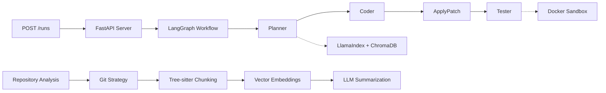

# Coda 🤖

[](https://python.org)
[](https://fastapi.tiangolo.com)
[](https://opensource.org/licenses/MIT)

> **AI-powered multi-agent system for automated code generation, testing, and deployment**

Coda orchestrates four specialized AI agents through a LangGraph workflow to automatically implement features, generate tests, and validate changes in isolated Docker environments.

## Key Features

- **Intelligent Planning** - Semantic repository analysis with LlamaIndex + ChromaDB
- **Smart Code Generation** - Context-aware unified git diffs with Azure OpenAI
- **Safe Git Operations** - Isolated branch creation and patch validation with fallback mechanisms
- **Sandboxed Testing** - Docker containers with network isolation
- **Repository Analysis** - AI-powered git repository summarization with dynamic cloning
- **Tree-sitter Chunking** - Language-specific semantic code parsing for Python, JavaScript, TypeScript, Go, Java
- **Vector Embeddings** - Azure OpenAI embeddings with smart rate limiting and batch processing
- **Multi-Provider Support** - LiteLLM integration for OpenAI, Anthropic, Azure, Cohere

## Getting Started

```bash
# Clone and setup
git clone git@github.com:varunbiluri/coda.git
cd coda
uv venv && source .venv/bin/activate
uv pip install -e .

# Build Docker sandbox
docker build -t coda-sandbox -f sandbox/Dockerfile sandbox/
```

## Configuration

### AI-Powered Code Generation (LiteLLM)

Coda uses **LiteLLM** for unified access to multiple AI providers. This gives you flexibility to choose from OpenAI, Anthropic, Azure, Cohere, and many other providers with a single interface.

<details>
<summary><strong>Option 1: OpenAI (Standard)</strong></summary>

1. **Get your OpenAI API key** from [OpenAI Platform](https://platform.openai.com/api-keys)

2. **Set your API key**:

   ```bash
   export OPENAI_API_KEY="your-api-key-here"
   export LITELLM_PROVIDER="openai"
   export LITELLM_MODEL="gpt-3.5-turbo"  # or gpt-4, gpt-4-turbo
   ```

3. **Configure environment**:
   ```bash
   cp .env.example .env
   # Edit .env and add your OpenAI API key
   ```

</details>

<details>
<summary><strong>Option 2: Anthropic Claude</strong></summary>

1. **Get your Anthropic API key** from [Anthropic Console](https://console.anthropic.com/)

2. **Set your API key**:

   ```bash
   export ANTHROPIC_API_KEY="your-anthropic-key-here"
   export LITELLM_PROVIDER="anthropic"
   export LITELLM_MODEL="claude-3-sonnet"  # or claude-3-haiku, claude-3-opus
   ```

3. **Configure environment**:
   ```bash
   cp .env.example .env
   # Edit .env and add your Anthropic API key
   ```

</details>

<details>
<summary><strong>Option 3: Azure OpenAI (Enterprise)</strong></summary>

1. **Get your Azure OpenAI credentials** from your Azure portal

2. **Set your Azure credentials**:

   ```bash
   export AZURE_API_KEY="your-azure-key-here"
   export AZURE_API_BASE="https://your-resource.openai.azure.com/"
   export LITELLM_PROVIDER="azure"
   export LITELLM_MODEL="gpt-35-turbo"  # your deployment name
   ```

3. **Configure environment**:
   ```bash
   cp .env.example .env
   # Edit .env and add your Azure credentials
   ```

</details>

<details>
<summary><strong> Option 4: Mock LLM (Testing/Demo)</strong></summary>

Use it for development and testing without API costs.

**Set in your .env file**:

```bash
USE_MOCK_LLM=true
```

**Or export environment variable**:

```bash
export USE_MOCK_LLM=true
```

**Limitations:**

- Fixed responses only
- By default limited to just a health endpoint
- No real AI capabilities

</details>

### Environment Variables

Copy the example environment file and configure your settings:

```bash
cp .env.example .env
# Edit .env with your API keys and preferences
```

Key environment variables:

**LLM Configuration:**

- `USE_MOCK_LLM`: Set to `true` to use mock client instead of AI models
- `LITELLM_PROVIDER`: LLM provider to use (`openai`, `anthropic`, `azure`, `cohere`)
- `LITELLM_MODEL`: Model name to use (e.g., `gpt-3.5-turbo`, `claude-3-sonnet`)
- `OPENAI_API_KEY`: Your OpenAI API key
- `ANTHROPIC_API_KEY`: Your Anthropic API key
- `AZURE_API_KEY`: Your Azure API key
- `AZURE_API_BASE`: Your Azure API base URL
- `COHERE_API_KEY`: Your Cohere API key


## Demo: Multi-Agent Workflow in Action

<details>
<summary><strong>Step 1: The Problem</strong></summary>

```bash
# Navigate to sample service and run failing test
cd examples/sample_service
python -m pytest tests/test_health.py -v
# Test fails: /health endpoint doesn't exist
```

**What you'll see:**

- Test failure because `/health` endpoint is missing
- Clear demonstration of the problem to solve

</details>

<details>
<summary><strong>Step 2: Let Coda Fix It</strong></summary>

```bash
# Go back to project root and start Coda
cd ../..
source .venv/bin/activate

# Start the server
invoke dev &

# Run the complete workflow!
invoke workflow-demo
```

**What happens:**

- **Planner Agent** analyzes the goal and repository context using LlamaIndex + ChromaDB
- **Coder Agent** generates unified git diff with commit message using Azure OpenAI
- **ApplyPatch Agent** applies changes to a new git branch with fallback mechanisms
- **Tester Agent** runs tests in isolated Docker container with network isolation

**Key Features Demonstrated:**
- **Intelligent Planning** - Semantic repository analysis
- **Smart Code Generation** - Context-aware unified diffs
- **Safe Git Operations** - Isolated branch creation and patch validation
- **Sandboxed Testing** - Docker containers with network isolation

</details>

<details>
<summary><strong>Step 3: See the Results</strong></summary>

```bash
# Check what Coda generated
LATEST_RUN=$(ls -t .runs/ | head -1)
echo "Generated code:"
cat ".runs/$LATEST_RUN/workspace/app/main.py"

# Verify the fix works
cd ".runs/$LATEST_RUN/workspace"
python -m pytest tests/test_health.py -v
# Test passes!
```

**What you'll find:**

- New `/health` endpoint in `app/main.py`
- Corresponding test updates
- Clean git commit with descriptive message
- All tests passing in the generated workspace
- **Generated Code Display** - Shows the actual diff and applied code
- **Professional Summary** - Complete workflow execution summary

</details>

## Repository Analysis: AI-Powered Git Repository Insights

Coda includes powerful repository analysis capabilities that can generate comprehensive technical summaries of any Git repository with intelligent code understanding and vector embeddings.

### Quick Start: Repository Analysis

```bash
# Analyze any Git repository with default settings
invoke repo-analysis-demo

# Analyze specific repository and branch
invoke repo-analysis-demo --repo-url="https://github.com/tiangolo/fastapi.git" --branch="master"

# Custom analysis focus
invoke repo-analysis-demo --repo-url="https://github.com/microsoft/vscode.git" --branch="main" --query="Analyze the TypeScript architecture and build system"
```

**What this does:**
- **Dynamic Repository Cloning** - Actually clones and analyzes the specified repository
- **Intelligent Git Strategy** - Chooses optimal checkout method (sparse, shallow, or full)
- **Tree-sitter Semantic Chunking** - Language-specific code parsing and understanding
- **Vector Embeddings** - Azure OpenAI or OpenAI embeddings for enhanced understanding
- **AI-Powered Summarization** - Generates professional technical summaries
- **Smart Rate Limiting** - Respects API limits while maximizing analysis quality

### Supported Repository Types

- **Python Projects** - FastAPI, Django, Flask applications
- **JavaScript/TypeScript** - Node.js, React, Vue.js applications
- **Go Projects** - Microservices, CLI tools, web services
- **Java Projects** - Spring Boot, Maven, Gradle applications
- **Multi-language** - Complex projects with multiple technologies
- **Documentation** - Well-documented repositories with comprehensive READMEs

### Example Output

The system generates professional technical summaries including:

- **Project Overview** - Clear description of what the repository does
- **Technology Stack** - Languages, frameworks, and tools used
- **Architecture** - Key components and how they work together
- **Getting Started** - Setup instructions and usage examples
- **Project Structure** - Important files and directories explained
- **Analysis Metrics** - Files processed, embeddings generated, execution time

### Advanced Features

- **Dynamic Repository Analysis** - Clones and analyzes any Git repository
- **Intelligent Git Checkouts** - Automatically chooses the most efficient checkout strategy
- **Tree-sitter Semantic Understanding** - Language-specific parsing for Python, JavaScript, TypeScript, Go, Java
- **Vector Embeddings** - Azure OpenAI, OpenAI, or local HuggingFace embeddings with smart rate limiting
- **Professional Summaries** - Enterprise-grade technical documentation generation
- **Scalable Processing** - Handles repositories of any size with intelligent chunking

## Architecture



### The Four Agents

| Agent             | Purpose                                                 | Technology                 |
| ----------------- | ------------------------------------------------------- | -------------------------- |
| **Planner**       | Analyzes repository context and creates execution plans | LlamaIndex semantic search |
| **Coder**         | Generates unified git diffs with commit messages        | Context-aware LLM (Azure OpenAI) |
| **ApplyPatch**    | Safely applies changes to new git branches              | GitPython validation + fallback |
| **Tester**        | Runs tests in isolated Docker containers                | Docker + pytest            |

### Repository Analysis Pipeline

| Component         | Purpose                                                 | Technology                 |
| ----------------- | ------------------------------------------------------- | -------------------------- |
| **Git Strategy**  | Intelligent checkout optimization                       | Sparse/dense/shallow clones |
| **Tree-sitter**   | Semantic code chunking and parsing                     | Language-specific AST parsing |
| **Vector Store**  | Embedding generation and storage                        | Azure OpenAI + ChromaDB |
| **LLM Pipeline**  | Repository summarization and insights                  | Azure OpenAI GPT models |

## Development

```bash
pip install --upgrade invoke
```

### Commands

```bash
# Development
invoke test                    # Run all tests with coverage
invoke lint                    # Code quality checks
invoke format-code             # Auto-format code
invoke dev                     # Development server with reload
invoke clean                   # Clean generated files

# Multi-Agent Workflow
invoke workflow-demo           # Complete workflow demonstration (Planner → Coder → ApplyPatch → Tester)

# Repository Analysis
invoke repo-analysis-demo      # AI-powered repository analysis with default settings
invoke repo-analysis-demo --repo-url="https://github.com/user/repo.git" --branch="main"
invoke repo-analysis-demo --repo-url="https://github.com/user/repo.git" --branch="main" --query="Custom analysis focus"

# Pre-commit hooks
invoke pre-commit-install      # Install pre-commit hooks
invoke pre-commit-run          # Run pre-commit on changed files
invoke pre-commit-run --all-files  # Run pre-commit on all files
invoke pre-commit-update       # Update pre-commit hook versions
```

## Future Roadmap

### Phase 1: Enhanced Repository Support
- **GitHub Integration**: Direct PR creation and management

### Phase 2: Developer Companion Features
- **Interactive Chat Interface**: Real-time chat with the AI system for code assistance
- **Code Review Assistant**: Automated code review with suggestions and improvements
- **Refactoring Support**: Intelligent code refactoring with safety checks
- **Documentation Generation**: Automatic API documentation and code comments

### Phase 3: Advanced AI Capabilities
- **Multi-Language Support**: Rust, TypeScript
- **Testing Strategies**: Comprehensive test generation and coverage analysis
- **Security Scanning**: Automated vulnerability detection and fixes
- **Performance Analysis**: Code optimization suggestions

### Phase 4: Enterprise Features
- **Monitoring and Analytics**: Development metrics and productivity insights
- **Custom Model Training**: Fine-tuned models for specific codebases and patterns
- **Team Collaboration**: Multi-user workflows and shared knowledge bases

## Documentation

- **API Docs**: http://localhost:8000/api/docs

## License

MIT License - see [LICENSE](LICENSE) file for details.

## Built With

- [LangGraph](https://github.com/langchain-ai/langgraph) - Multi-agent orchestration
- [FastAPI](https://fastapi.tiangolo.com/) - High-performance web framework
- [LlamaIndex](https://www.llamaindex.ai/) - Semantic search and indexing
- [ChromaDB](https://www.trychroma.com/) - Vector database
- [Docker](https://www.docker.com/) - Containerized testing
- [LiteLLM](https://github.com/BerriAI/litellm) - Unified LLM interface
- [Tree-sitter](https://tree-sitter.github.io/) - Language-specific semantic code parsing

---

**Automating the future of software development**
