# Coda 🤖

[](https://python.org)
[](https://fastapi.tiangolo.com)
[](https://opensource.org/licenses/MIT)

> **AI-powered multi-agent system for automated code generation, testing, and deployment**

Coda orchestrates four specialized AI agents through a LangGraph workflow to automatically implement features, generate tests, and validate changes in isolated Docker environments.

## ✨ Key Features

- 🧠 **Intelligent Planning** - Semantic repository analysis with LlamaIndex + ChromaDB
- 💻 **Smart Code Generation** - Context-aware unified git diffs
- 🔧 **Safe Git Operations** - Isolated branch creation and patch validation
- 🧪 **Sandboxed Testing** - Docker containers with network isolation

## 🚀 Quick Start

```bash
# Clone and setup
git clone <repository-url>
cd coda
uv venv && source .venv/bin/activate
uv pip install -e .

# Build Docker sandbox
docker build -t coda-sandbox -f sandbox/Dockerfile sandbox/
```

## 🔧 Configuration

### AI-Powered Code Generation (Default)

Coda supports multiple AI providers for intelligent code generation. The system automatically detects and uses the appropriate client based on your configuration.

<details>
<summary><strong>🔵 Option 1: OpenAI (Standard)</strong></summary>

1. **Get your OpenAI API key** from [OpenAI Platform](https://platform.openai.com/api-keys)

2. **Set your API key**:

   ```bash
   export OPENAI_API_KEY="your-api-key-here"
   export OPENAI_MODEL="gpt-3.5-turbo"  # or gpt-4
   ```

3. **Configure environment**:
   ```bash
   cp .env.example .env
   # Edit .env and add your OPENAI_API_KEY
   ```

</details>

<details>
<summary><strong>🏢 Option 2: Azure OpenAI (Enterprise)</strong></summary>

1. **Get your Azure OpenAI credentials** from your Azure portal

2. **Set your Azure credentials**:

   ```bash
   export AZURE_OPENAI_API_KEY="your-azure-key-here"
   export AZURE_OPENAI_ENDPOINT="https://your-resource.openai.azure.com/"
   export AZURE_OPENAI_MODEL="gpt-35-turbo"  # Your deployment name
   export AZURE_OPENAI_API_VERSION="2024-02-01"  # Optional
   ```

3. **Configure environment**:
   ```bash
   cp .env.example .env
   # Edit .env and add your Azure OpenAI credentials
   ```

</details>

<details>
<summary><strong>🧪 Option 3: Mock LLM (Testing/Demo)</strong></summary>

Use it for development and testing without API costs.

**Set in your .env file**:

```bash
USE_MOCK_LLM=true
```

**Or export environment variable**:

```bash
export USE_MOCK_LLM=true
```

**Limitations:**

- ⚠️ Fixed responses only
- ⚠️ By default limited to just an health endpoint
- ⚠️ No real AI capabilities

</details>

### Environment Variables

Copy the example environment file and configure your settings:

```bash
cp .env.example .env
# Edit .env with your OpenAI API key and preferences
```

Key environment variables:

**LLM Configuration:**

- `USE_MOCK_LLM`: Set to `true` to use mock client instead of AI models
- `OPENAI_API_KEY`: Your OpenAI API key (for standard OpenAI)
- `OPENAI_MODEL`: Model to use (`gpt-3.5-turbo`, `gpt-4`, etc.)
- `AZURE_OPENAI_API_KEY`: Your Azure OpenAI API key (takes priority if set)
- `AZURE_OPENAI_ENDPOINT`: Your Azure OpenAI endpoint URL
- `AZURE_OPENAI_MODEL`: Your Azure deployment name (e.g., `gpt-35-turbo`)

**Server Configuration:**

- `CODA_HOST`: Server host (default: `0.0.0.0`)
- `CODA_PORT`: Server port (default: `8000`)
- `TOKENIZERS_PARALLELISM`: Set to `false` to avoid warnings

## 🎬 Demo: From Failing Test to Working Code

<details>
<summary><strong>📋 Step 1: Show the Problem</strong></summary>

```bash
# Navigate to sample service and run failing test
cd examples/sample_service
python -m pytest tests/test_health.py -v
# ❌ Test fails: /health endpoint doesn't exist
```

**What you'll see:**

- Test failure because `/health` endpoint is missing
- Clear demonstration of the problem to solve

</details>

<details>
<summary><strong>🤖 Step 2: Let Coda Fix It</strong></summary>

```bash
# Go back to project root and start Coda
cd ../..
source .venv/bin/activate
export TOKENIZERS_PARALLELISM=false

# Start the server
invoke run &

# Run the magic! 🪄
invoke demo
```

**What happens:**

- 🧠 **Planner Agent** analyzes the goal and repository
- 💻 **Coder Agent** generates the required code changes
- 🔧 **ApplyPatch Agent** applies changes to a new git branch
- 🧪 **Tester Agent** runs tests in isolated Docker container

</details>

<details>
<summary><strong>✅ Step 3: See the Results</strong></summary>

```bash
# Check what Coda generated
LATEST_RUN=$(ls -t .runs/ | head -1)
echo "Generated code:"
cat ".runs/$LATEST_RUN/workspace/app/main.py"

# Verify the fix works
cd ".runs/$LATEST_RUN/workspace"
python -m pytest tests/test_health.py -v
# ✅ Test passes!
```

**What you'll find:**

- New `/health` endpoint in `app/main.py`
- Corresponding test updates
- Clean git commit with descriptive message
- All tests passing in the generated workspace

</details>

## 🏗️ Architecture

```mermaid
graph LR
    A[POST /runs] --> B[FastAPI Server]
    B --> C[LangGraph Workflow]
    C --> D[🧠 Planner]
    D --> E[💻 Coder]
    E --> F[🔧 ApplyPatch]
    F --> G[🧪 Tester]

    D -.-> H[LlamaIndex + ChromaDB]
    G -.-> I[Docker Sandbox]
```



### The Four Agents

| Agent             | Purpose                                                 | Technology                 |
| ----------------- | ------------------------------------------------------- | -------------------------- |
| 🧠 **Planner**    | Analyzes repository context and creates execution plans | LlamaIndex semantic search |
| 💻 **Coder**      | Generates unified git diffs with commit messages        | Context-aware LLM          |
| 🔧 **ApplyPatch** | Safely applies changes to new git branches              | GitPython validation       |
| 🧪 **Tester**     | Runs tests in isolated Docker containers                | Docker + pytest            |

## 🛠️ Development

### Commands

```bash
invoke test                    # Run all tests with coverage
invoke lint                    # Code quality checks
invoke format                  # Auto-format code
invoke dev                     # Development server with reload
invoke clean                   # Clean generated files

# Pre-commit hooks
invoke pre-commit-install      # Install pre-commit hooks
invoke pre-commit-run          # Run pre-commit on changed files
invoke pre-commit-run --all-files  # Run pre-commit on all files
invoke pre-commit-update       # Update pre-commit hook versions
```

### 🚧 Planned Enhancements

- **LLM Integration**: OpenAI GPT-4 support
- **Git Integration**: GitHub/GitLab PR automation

## 📚 Documentation

- **API Docs**: http://localhost:8000/api/docs

## 📄 License

MIT License - see [LICENSE](LICENSE) file for details.

## 🏆 Built With

- [LangGraph](https://github.com/langchain-ai/langgraph) - Multi-agent orchestration
- [FastAPI](https://fastapi.tiangolo.com/) - High-performance web framework
- [LlamaIndex](https://www.llamaindex.ai/) - Semantic search and indexing
- [ChromaDB](https://www.trychroma.com/) - Vector database
- [Docker](https://www.docker.com/) - Containerized testing

---

**Automating the future of software development** 🚀
